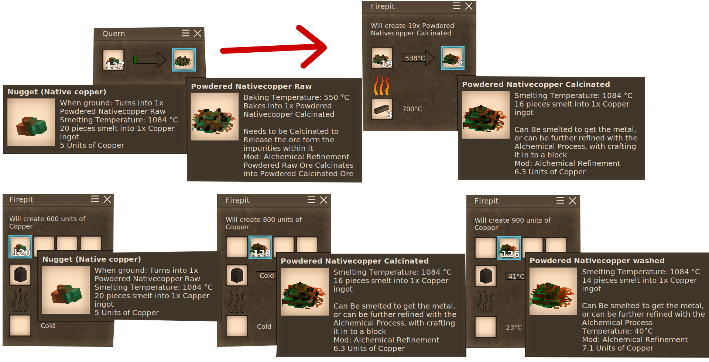

# Alchemical Refinement

---

the mod lets you follow the Alchemical Process to refine ore.

Still a Work In Progress mod.

as of now there is only a panning mechanic and i will try as far as i can to make use of vanilla mechanics for this mod.

I will at some point make another mod that expands on this with C# code but for now this will be the base mod for it.

## The Process:(WIP)

1. Grind ore nuggets in a Grind stone(Quern) to create the powdered ore to make it easier to purify it.

2. [Calcinate/Roast](operations/Calcination-Firepit.png) in a firepit to remove the volatile impurities.

3. [Combine the calcinated ore](operations/OreBlock-Crafting.png) in to a block in a grid.

4. [Washed](operations/Washing-Block.png) with the [Ore Washing Pan](operations/Ore-Washing-Pan-Craft.png) to remove the soluble impurities.

5. [Washed block can be broken](operations/OreBlock_Drops.png) in to the washed powder.

6. Smelt it in a crucible.

### Stages of Alchemy:

1. [Calcination:](operations/1-Calcination.md) The burning away of impurities through intense heat or fire.

2. [Dissolution:](operations/2-Dissolution.md) The breaking down of the remaining material into a solution.

3. [Seperation:](operations/3-Seperation.md) The removal of any remaining impurities from the solution.

4. [Conjunction:](operations/4-Conjunction.md) The union of purified substances to create something new.

5. [Fermentation:](operations/5-Fermentation.md) The process of allowing the new substance to mature and develop.

6. [Distillation:](operations/6-Distillation.md) The separation and concentration of the pure essence of the substance.

7. [Coagulation:](operations/7-Coagulation.md) The solidification of the purified essence into a new form or state.

## Known Bugs:

- extra info causes crash is you access the handbook page for the ore washing pan if it is installed.

## NB!

as of now the mod is not Balanced and it might give you a little much for that little effort it takes.

i will rebalance it at some point but i would like some input on that
 so feel free to comment or create a issue on github for that if you 
think it gives to much.

i try to not make it ore double but give you extra ore types based on
 real world geological occurance of minerals and asosiated minerals.

but as of now it will give you around 1.5 increase in yield from the 
base ore item, and some extra ore assosiated with the base ore.

## Rcommended mods:

[Geology Additions](https://mods.vintagestory.at/show/mod/8054)

[Better Firepit](https://mods.vintagestory.at/show/mod/5589 "Better Firepit")

[Ores-A-Plenty](https://mods.vintagestory.at/oresaplenty)

For those of you that struggle to see the ore block: [Juicy Ores](https://mods.vintagestory.at/show/mod/2602 "Juicy Ores")
